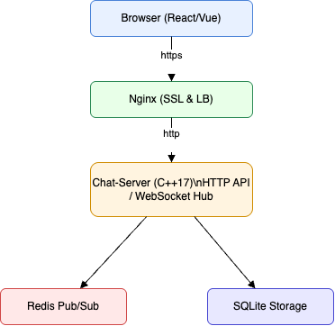

# 高层架构概述

下面展示了系统的高层组件及数据流向关系。请先查看同目录下的 `architecture.svg`，再阅读以下文字说明。

## 组件及职责

**浏览器 (React/Vue)**  
负责渲染用户界面，通过 HTTPS 调用后端 REST API，并通过 WebSocket 建立长连接接收实时消息。

**Nginx (SSL 终结 & 负载均衡)**  
对外暴露 HTTPS 和 WSS 接口，处理 SSL 加密／解密；将请求反向代理到后端服务，实现多实例负载均衡。

**Chat‑Server (C++17)**  
- 提供 HTTP API（注册/登录、历史消息拉取等）  
- 维护 WebSocket 连接，执行业务逻辑（消息广播、房间管理）  
- 内部负责鉴权（JWT）、心跳检测、断线重连等功能

**Redis (Pub/Sub)**  
负责后端多个实例间的消息广播，同步各实例上的实时群聊消息；不负责持久化。

**SQLite (消息持久化)**  
在本地文件中存储聊天记录和必要的用户数据，支持分页查询历史消息；轻量、易部署。

## 技术决策与替代方案

- **消息广播层**：  
  选用 Redis Pub/Sub 而非 Kafka，因为 Redis 启动和运维成本低、延迟小，符合项目中小规模、高并发的需求。  
- **持久化存储**：  
  选用 SQLite 而非 MySQL/PostgreSQL，避免额外的数据库运维工作；待项目规模扩大时可切换到分布式数据库。  
- **后端框架**：  
  使用 C++17 结合 Boost.Asio 或 uWebSockets，既满足高并发、低延迟的性能要求，又能锻炼底层网络编程能力。

## 后续扩展方向

- **存储扩展**：  
  当消息量或并发用户数进一步增加，可将 SQLite 替换为分布式数据库，或在 Redis 上开启持久化 AOF/RDB。  
- **消息队列升级**：  
  如需更强的消息可靠性和路由能力，可引入 Kafka、RabbitMQ 等成熟消息队列。  
- **监控与可观测**：  
  为各组件埋点，接入 Prometheus、Grafana，监控在线用户数、消息吞吐量、错误率等指标。  
- **CI/CD & 部署**：  
  在现有 GitHub Actions 基础上，添加镜像构建与推送步骤，结合 Kubernetes 或 Docker Swarm 实现自动化部署和灰度发布。